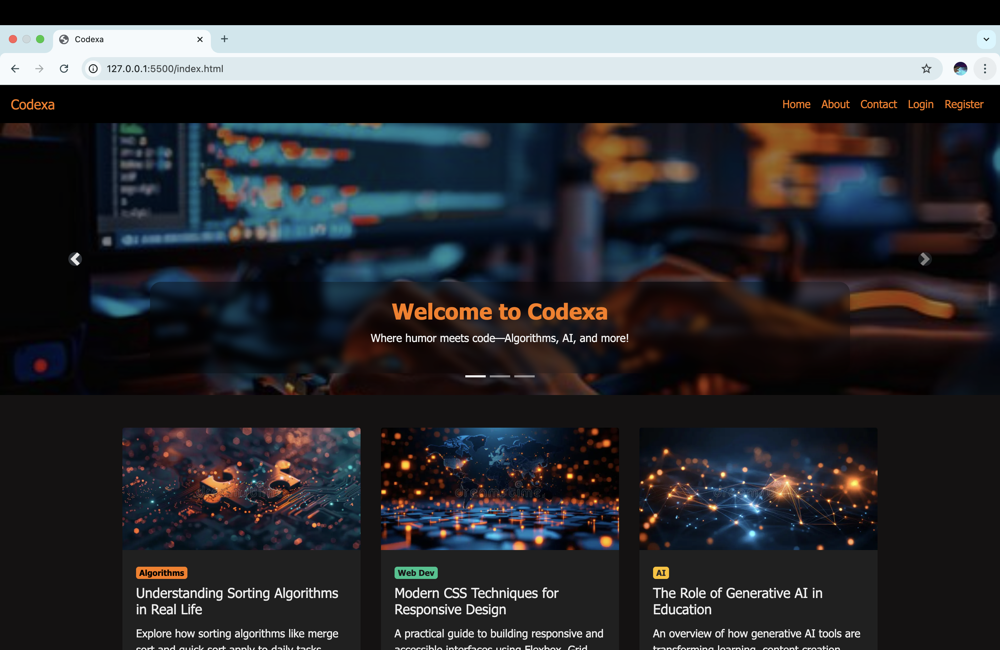
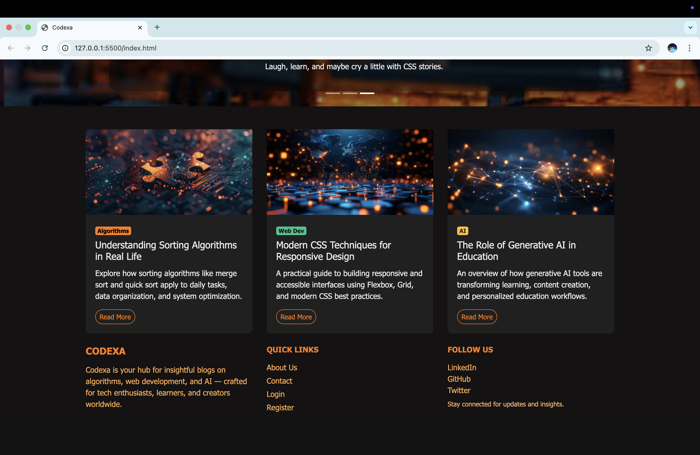
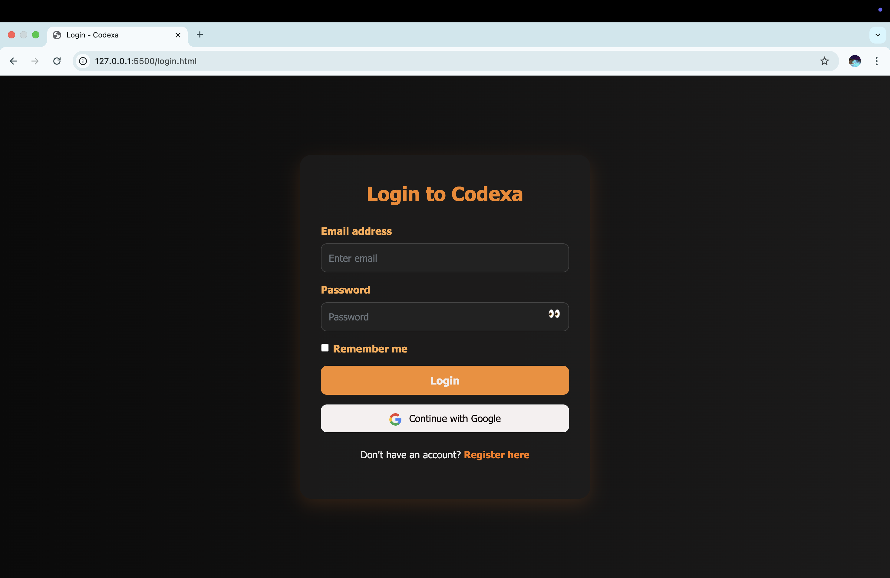
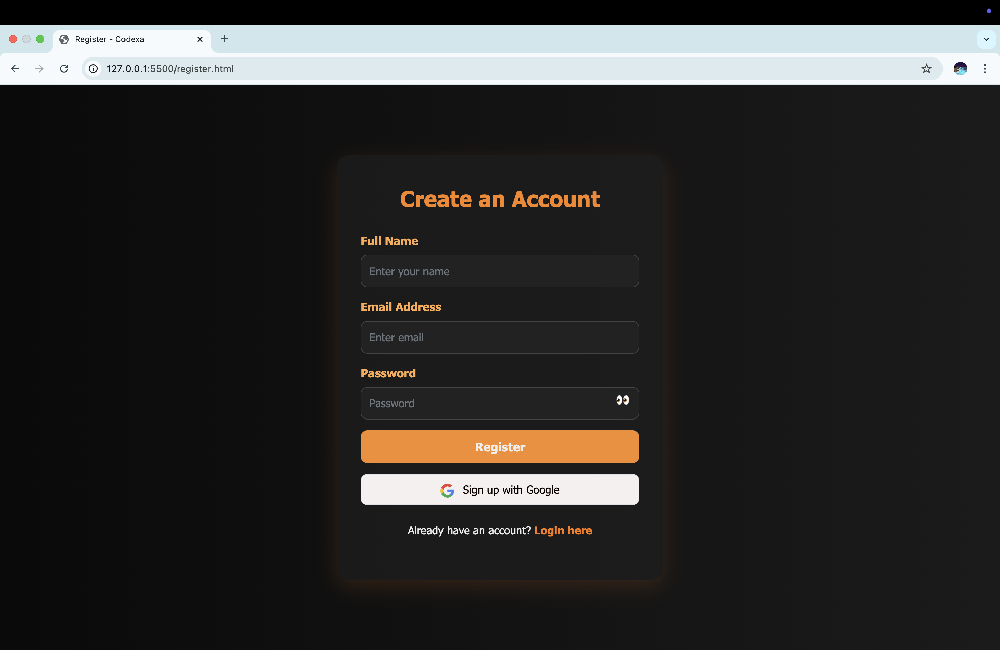
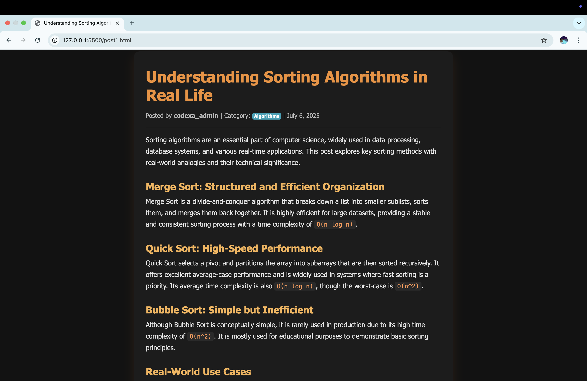
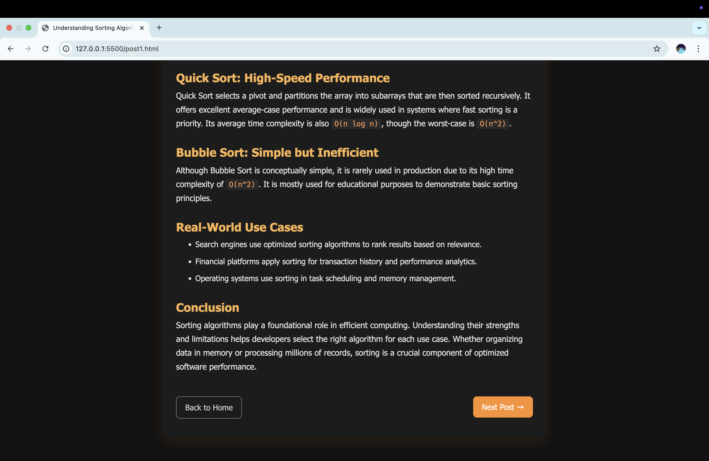
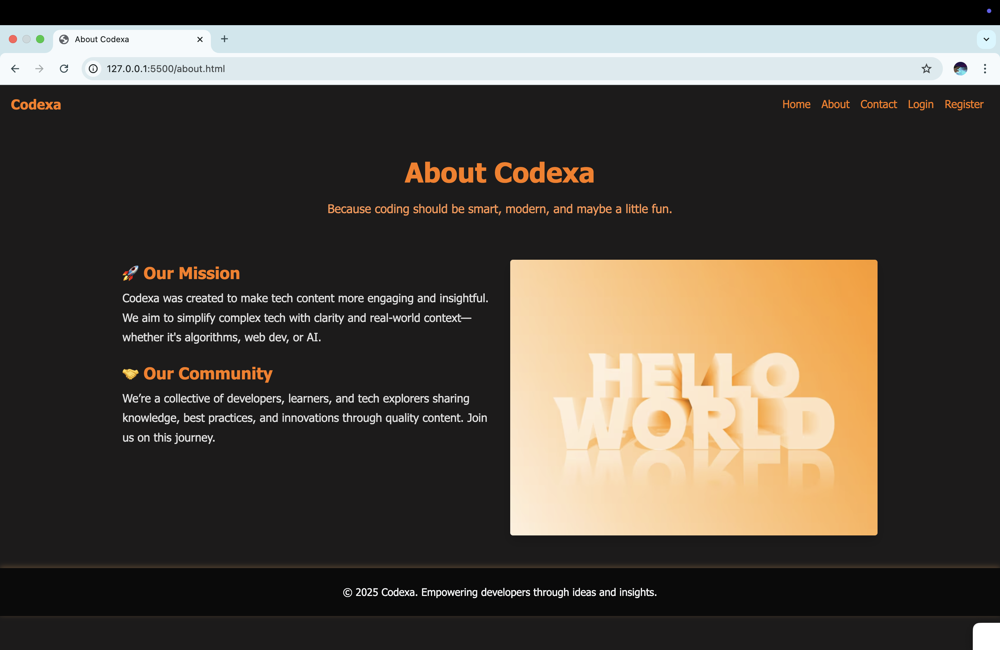
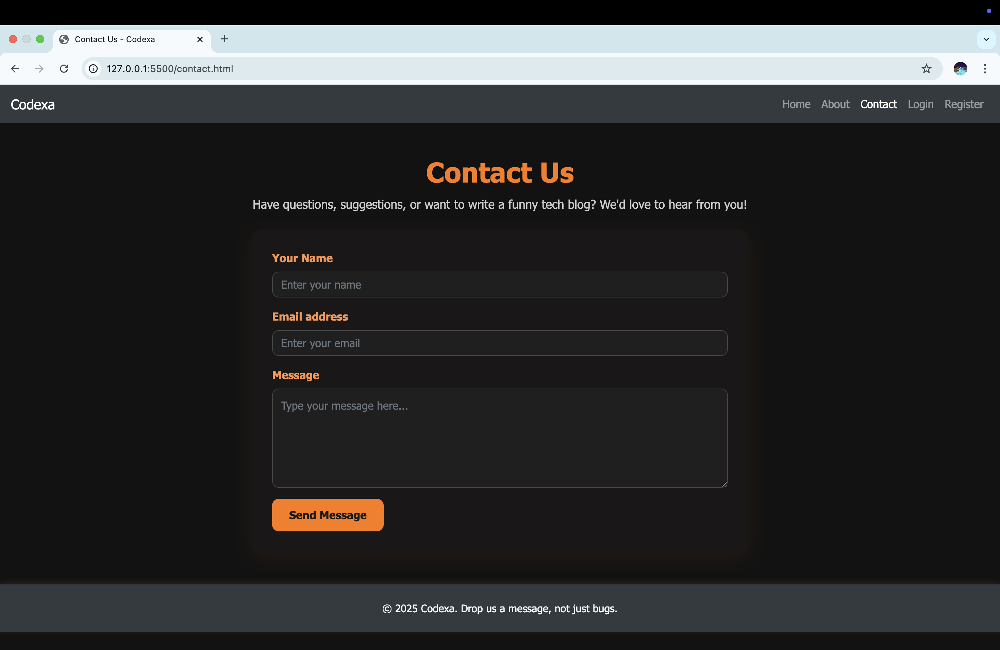

# Codexa

**Codexa** is a responsive and professionally designed coding blog built using **HTML5**, **CSS3**, and **Bootstrap 4**.  
It features a modern black and orange theme and covers a range of programming topics, including:

- Algorithms  
- Web Development  
- Artificial Intelligence

---

## Tech Stack

- **HTML5**
- **CSS3**
- **Bootstrap 4.6**
- Fully responsive layout design

---

##  Key Features

- Clean and dark-themed user interface
- Multiple blog post pages
- Separate login and registration pages
- Responsive contact and about sections
- Professional layout optimized for readability

---
##  Project Goals
Showcase front-end development skills using HTML, CSS3, and Bootstrap.

Design a clean, responsive coding blog with a consistent black-orange theme.

Demonstrate UI/UX design sense with blog layout and content structure.

Build a scalable static site suitable for technical writing and portfolio use.

Practice deploying and maintaining a professional-looking web project.

##  Screenshots

### 🔹 Homepage

  

---

### 🔹 Login Page

---

### 🔹 Register Page

---

### 🔹 Blog Post Page

  

---

### 🔹 About Page

---

### 🔹 Contact Page

---

